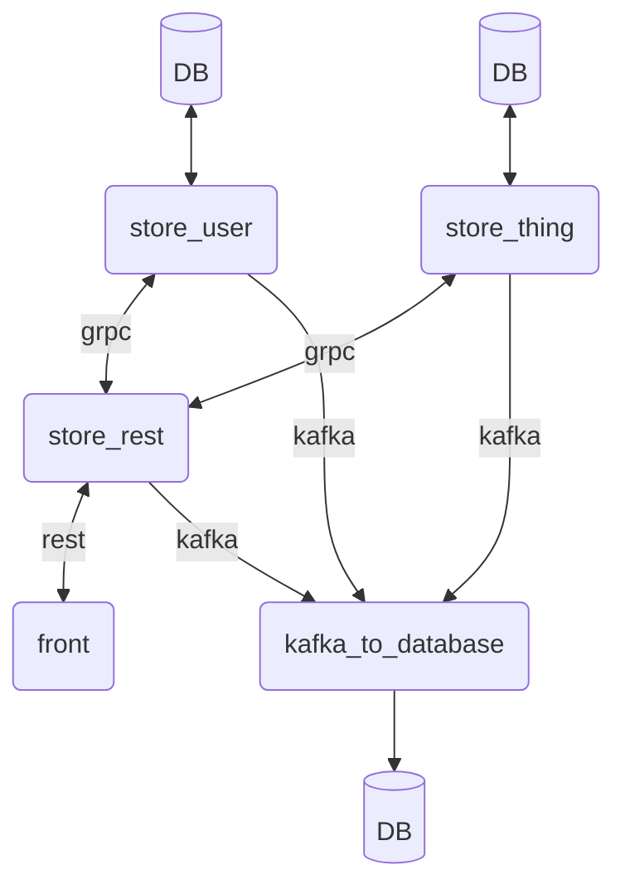

- [store_rest](https://github.com/KirillBelyaev74/store_rest)
- [store_thing](https://github.com/KirillBelyaev74/store_thing)
- [store_user](https://github.com/KirillBelyaev74/store_user)
- [kafka_to_database](https://github.com/KirillBelyaev74/kafka_to_database)
- [logging_to_kafka](https://github.com/KirillBelyaev74/logging_to_kafka)
- [store_devOps](https://github.com/KirillBelyaev74/store_devOps)

```
    - Kotlin
    - Postgres
    - Spring
    - GRPC
    - Docker
    - Kafka
    - Kubernetes
```


```
Docker 
    - docker build --no-cache -t kirbel74/thing:latest .
    - docker push kirbel74/thing:latest
    - docker rm $(docker ps -a -q -f status=exited)

    - https://habr.com/ru/companies/flant/articles/336654/ 
    - https://habr.com/ru/companies/timeweb/articles/595687/ 
```
```
Kubernetes
    - kubectl config get-contexts
    - kubectl cluster-info
    - kubectl config use-context <NAME>
    
    - minikube service <service name> --url
    - minikube tunnel
    
    - cat /etc/hosts
```